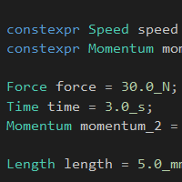
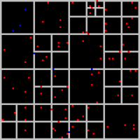
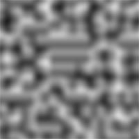

# Exercises
## Units

Handling of the various SI units using type rich programming.

---

## QuadTree

Quadtree algorithm plus its visualisation and basic mouse control to add points.

---

## PerlinNoise

Implementation of the classic **perlin noise** introduced by Ken Perlin (*Perlin, Ken (July 1985). "An Image Synthesizer". SIGGRAPH Comput. Graph. 19 (97–8930): 287–296. doi:10.1145/325165.325247*).
